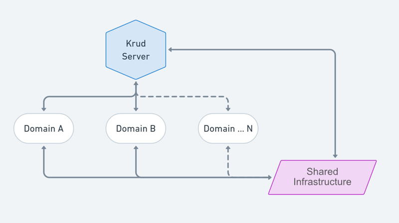

## Project Structure

**Krud** is organized into a multi-project setup, where each component (_subproject_) serves a distinct role within
the overall server architecture:

1. [server](../krud-server) is the primary project component, responsible for server initialization, and integration of all server components.
   It manages the server's lifecycle from startup to shut-down and serves as the backbone of the application's operations.

2. [core](../krud-system/core) provides shared infrastructure and services, such as utility functions, and server configurations
   Designed to support operational needs of domain-specific components, promoting code reuse to shared concerns.

3. [database](../krud-system/core) provides the database connection and management services, including database migrations and schema.
   This module **is not** responsible for domain-specific database operations but provides the necessary infrastructure to support them.

4. [access](../krud-system/access) provides security and access control services, including authentication, authorization,
   and actors management. It leverages the `core` and `database` for shared functionalities.

5. [employee](../krud-domain/employee) is a specialized domain component dedicated to managing employee records, encompassing all CRUD operations.
   It leverages the `core` and `database` for shared functionalities, and `access` for security and access control.

6. [employment](../krud-domain/employment) manages employment related data and logic, relying on
   `employee` for accessing specific employee
   details, `core` and `database` for shared functionalities, and `access` for security and access control.

### A note about startup times.

**Krud** server startup time can be optimized by disabling unnecessary features.
[Turn off](../krud-system/core/src/main/resources/config/config_api_schema.conf) documentation API schema generation.
Conduct database migrations in a controlled setting, not in production. Manage these settings via `hconf` configuration files.
