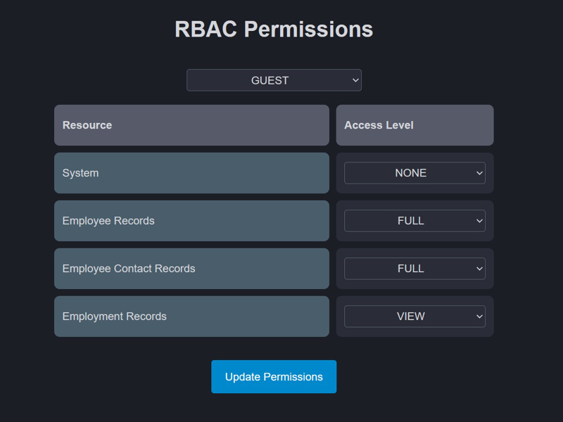

## RBAC (Role Based Access Control)

The project also includes an [RBAC](../kcrud-access/src/main/kotlin/kcrud/access/rbac) implementation, including a basic role [admin panel](../kcrud-access/src/main/kotlin/kcrud/access/rbac/views) build with HTML DSL.
[Sample actors](../kcrud-access/src/main/kotlin/kcrud/access/actor/service/DefaultActorFactory.kt) and roles are created at runtime.



Whenever endpoints require RBAC management, these should be wrapped as follows:

```kotlin
withRbac(resource = RbacResource.SOME_RESOURCE, accessLevel = RbacAccessLevel.FULL) {
    get("/some-endpoint") {
        // endpoint logic block
    }
    // It is allowed to include more endpoints under the same resource and access level.
}
```

[RbacResource](../kcrud-base/src/main/kotlin/kcrud/base/database/schema/admin/rbac/types/RbacResource.kt) and [RbacAccessLevel](../kcrud-base/src/main/kotlin/kcrud/base/database/schema/admin/rbac/types/RbacAccessLevel.kt) define a type of resource and its required access level.
Multiple endpoints can be wrapped under the same [withRbac](../kcrud-access/src/main/kotlin/kcrud/access/rbac/plugin/WithRbac.kt) block, or use multiple `withRbac` blocks for different resources and levels.

A resource can be any concept: a database table, a REST endpoint, a UI element, etc.
It is up to the designer to define what a resource is, and act accordingly when its associated RBAC rule is verified.

Once an endpoint is wrapped under a [withRbac](../kcrud-access/src/main/kotlin/kcrud/access/rbac/plugin/WithRbac.kt) block, it becomes accessible only to
**Actors** that have being assigned
a **Role** that includes both the RBAC block associated resource and access level.

- Field Level access control is partially implemented. Each RBAC resource rule has a [fieldRules](../kcrud-access/src/main/kotlin/kcrud/access/rbac/entity/field_rule) map that
  can be used to define which fields must be managed, for example, should be anonymized. For such, the target entity
  must inherit from [BaseRbacEntity](../kcrud-access/src/main/kotlin/kcrud/access/rbac/entity/base/BaseRbacEntity.kt), and call the anonymize function accordingly based on the defined field rules,
  for example, before returning the entity to a client.
