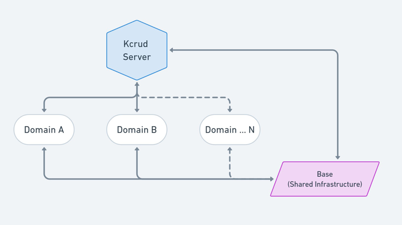
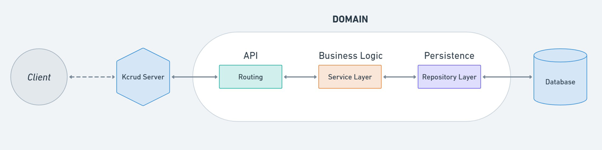
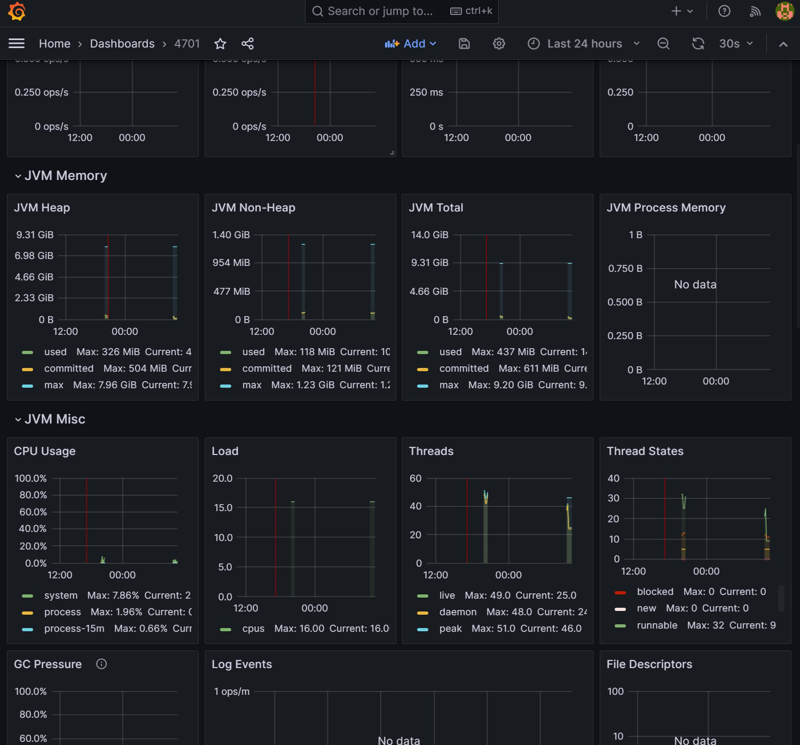
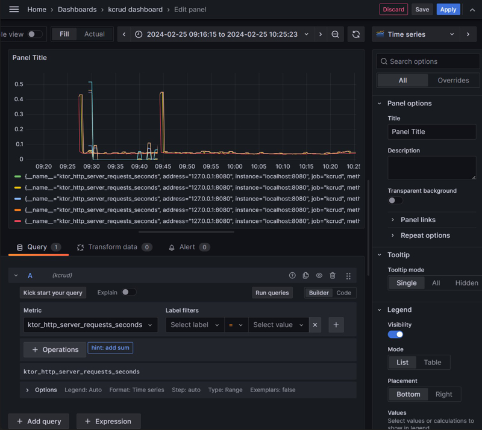

# [Kcrud](https://github.com/perracodex/Kcrud)

A [Ktor](https://ktor.io/) REST server.

### Characteristics:

* [Multi-project](#project-structure) setup.
* [Exposed](https://github.com/JetBrains/Exposed) database framework.
* [Database Connection Pooling](./kcrud-base/src/main/kotlin/kcrud/base/database/service/DatabasePooling.kt) with [HikariCP ](https://github.com/brettwooldridge/HikariCP).
* [Encryption](./kcrud-base/src/main/kotlin/kcrud/base/database/schema/contact/ContactTable.kt) at field level example.
* [Koin](./kcrud-server/src/main/kotlin/kcrud/server/plugins/Koin.kt) dependency injection.
* [Quartz Scheduler](./kcrud-base/src/main/kotlin/kcrud/base/scheduling) integration. A popular and [flexible](https://github.com/quartz-scheduler/quartz/blob/main/docs/introduction.adoc) job scheduling library.
* [In-memory hashed passwords](./kcrud-access/src/main/kotlin/kcrud/access/credential/CredentialService.kt) storage lookup, with enhanced security.
* [Sortable pagination](./kcrud-base/src/main/kotlin/kcrud/base/persistence/pagination) and filtering examples.
* [JSON serialization](https://ktor.io/docs/serialization.html) with [Kotlinx](https://github.com/Kotlin/kotlinx.serialization/blob/master/docs/serialization-guide.md).
* [RBAC (Role Based Access Control)](./kcrud-access/src/main/kotlin/kcrud/access/rbac) example, including a basic role [admin panel](./kcrud-access/src/main/kotlin/kcrud/access/rbac/views).
* [JWT authentication](./kcrud-access/src/main/kotlin/kcrud/access/plugins/AuthJwt.kt) example.
* [Basic authentication](./kcrud-access/src/main/kotlin/kcrud/access/plugins/AuthBasic.kt) example.
* [Connection Rate limit](kcrud-base/src/main/kotlin/kcrud/base/plugins/RateLimits.kt) examples.
* [HTML DSL](https://ktor.io/docs/html-dsl.html) example.
* [H2](https://github.com/h2database/h2database) embedded database, both in-memory and file-based.
* [HOCON](./kcrud-base/src/main/resources/config) configuration example, including [parsing](./kcrud-base/src/main/kotlin/kcrud/base/settings) for strongly typed settings.
* [Swagger-UI](https://ktor.io/docs/swagger-ui.html#configure-swagger), [Redoc](https://swagger.io/blog/api-development/redoc-openapi-powered-documentation/), and [OpenAPI](https://ktor.io/docs/openapi.html) integration.
* [Routing](./kcrud-server/src/main/kotlin/kcrud/server/plugins/Routes.kt) organization examples.
* [Call Logging](https://ktor.io/docs/call-logging.html) and [Call ID](https://ktor.io/docs/call-id.html) examples for events traceability.
* [Snowflake](./kcrud-base/src/main/kotlin/kcrud/base/security/snowflake) unique IDs for logging purposes, suitable for distributed systems.
* [Micrometer Metrics](./kcrud-base/src/main/kotlin/kcrud/base/plugins/MicrometerMetrics.kt) with Prometheus integration. Configuration steps for Prometheus and Grafana are [included](#micrometer-metrics).
* [Flyway](https://github.com/flyway/flyway) database migration example.
* [Schema aware database transactions](./kcrud-base/src/main/kotlin/kcrud/base/database/service/TransactionWithSchema.kt), allowing to execute concrete transactions per schema.
* Examples for [custom serializers](./kcrud-base/src/main/kotlin/kcrud/base/persistence/serializers), [custom validators](./kcrud-base/src/main/kotlin/kcrud/base/persistence/validators), [custom exceptions](./kcrud-base/src/main/kotlin/kcrud/base/errors), and [custom table column](./kcrud-base/src/main/kotlin/kcrud/base/database/custom_columns) constraints.
* [Environment variables](#environment-variables-management) management example
* [Fat Jar building](#building-and-executing-a-fat-jar) and execution example.
* [Docker containerization](#docker-containerization) example.

---

For convenience, it is included a *[Postman Collection](./.postman/kcrud.postman_collection.json)* with all the available REST endpoints.

---

## Preface

[Kcrud](https://github.com/perracodex/Kcrud) serves as a comprehensive example of a Ktor server, showcasing a variety of features and best practices.

The code intentionally contains redundancies and inconsistencies to illustrate different approaches and strategies to achieve
similar results. For example, different authentication methods (JWT and Basic, despite Basic being discouraged); different approaches
to exception handling and validations across layers. The project also delves into data persistence, illustrating different methods
to store enums in databases, field level encryption, etc.

---

## Project Structure

**Kcrud** is organized into a multi-project setup, where each component (_subproject_) serves a distinct role within
the overall server architecture:

1. [kcrud-server](./kcrud-server) is the primary project component, responsible for server initialization, and integration of all server components.
   It manages the server's lifecycle from startup to shut-down and serves as the backbone of the application's operations.

2. [kcrud-base](./kcrud-base) provides shared infrastructure and services, such as utility functions, server configurations, and database
   connection facilities. Designed to support operational needs of domain-specific components, promoting code reuse to shared concerns.

3. [kcrud-access](./kcrud-access) provides security and access control services, including authentication, authorization,
   and user management. It leverages the ```kcrud-base``` for shared functionalities.

4. [kcrud-employee](./kcrud-employee) is a specialized domain component dedicated to managing employee records, encompassing all CRUD operations.
   It leverages the ```kcrud-base``` component for shared functionalities, and ```kcrud-access``` for security and access control.

5. [kcrud-employment](./kcrud-employment) manages employment related data and logic, relying on ```kcrud-employee``` for accessing specific employee
   details, ```kcrud-base``` for shared services, and ```kcrud-access``` for security and access control.



### A note about startup times.

**Kcrud** server startup time can be optimized by disabling unnecessary features. Turn off documentation generation.
Conduct database migrations in a controlled setting, not in production. Manage these settings via `hconf` configuration files.

---

## Domain Component Design Overview

[Kcrud](https://github.com/perracodex/Kcrud) components follow a structured approach to ensure clean separation of concerns.
The architecture is divided into several layers, each with a specific role, promoting maintainability and scalability:

[Routing Layer](./kcrud-employee/src/main/kotlin/kcrud/domain/employee/routing): This is the entry point for all incoming requests. [Routes](https://ktor.io/docs/routing-in-ktor.html) define the endpoints available
in the Kcrud server, directing requests to the appropriate Service Layer based on the request path and method.

[Service Layer](./kcrud-employee/src/main/kotlin/kcrud/domain/employee/service): Services act as the intermediary between the route handlers and the repository layer.
This layer contains business logic and rules, request validation, and orchestration of data operations.

[Repository Layer](./kcrud-employee/src/main/kotlin/kcrud/domain/employee/repository): At the core of data management, the repository layer interacts with the database.
It abstracts the data access, providing a collection of methods for retrieving and storing data.



### A note about concurrency

The `Ktor` framework is designed to enable asynchronous operations within its [routing](https://ktor.io/docs/routing-in-ktor.html) system by leveraging Kotlin's `suspend` functions.
This facilitates efficient, non-blocking I/O, optimizing resource use and enhancing concurrent handling of numerous requests
simultaneously without requiring extensive resources.

**Kcrud** leverages Ktor's asynchronous nature through **suspendable** functions in all **Service Layers**, allowing seamless operations
within an asynchronous context.

Conversely, **Repository Layers** employ intentionally standard **non-suspendable** functions for transaction management
simplicity, avoiding issues that can arise from coroutine-based transactions, such as challenges with nested transactions,
rollbacks, or scenarios where repositories may need to invoke other repositories. This approach ensures straightforward
transaction processing, with repositories designed to be accessed only from within suspendable **Service Layer** methods.

--- 

## Environment Variables Management

The server configurations are managed through environment variables, centralized within a [.env](./.env) file.
This standardizes settings across environments and deployment phases.

* **Configuration Files:** Settings are primarily defined within [HOCON](./kcrud-base/src/main/resources/config) files.
  These configurations use placeholders for variables, filled at runtime from the `.env` file or directly from the environment.

* **Local Development:** Running the server locally automatically incorporates `.env` values.

* **Docker:** In Docker environments, **Docker Compose** uses the `.env` file to set environment variables for containers,
  bypassing the server's direct loading of the `.env` file, and instead injecting the variables directly into the Docker environment.

---

## Building and Executing a Fat JAR

The [Ktor Gradle plugin](https://ktor.io/docs/fatjar.html#build) allows to create and run an executable JAR that includes all code dependencies (fat JAR).

* **Building the fat JAR:** Employ the `buildFatJar` Gradle task provided by Ktor.


* To run the **fat JAR** locally, either execute the `runFatJar` Gradle task or use the command line.
  For the latter, open a terminal and navigate to the root `build/libs` directory, where the **fat JAR**
  is located. Execute the following command:

```
java.exe -jar kcrud-1.0.0-all.jar
```

### Testing the fat JAR:

Upon server startup, observe the console output. Once initialization is complete, you can test the server by
opening a web browser and navigating to any of the following URLs:

http://localhost:8080

http://localhost:8080/demo?page=0&size=24

http://localhost:8080/health

http://localhost:8080/rbac/login

---

## Docker Containerization

Ensure Docker is [installed](https://www.docker.com/products/docker-desktop/) and operational in your local environment.

### Docker Advantages:

* Automated **fat JAR** creation using the provided [docker-full-build.Dockerfile](./docker-full-build.Dockerfile).
* Alternative  [docker-no-build.Dockerfile](./docker-no-build.Dockerfile) for scenarios preferring the use of a pre-built **fat JAR**.
* Simplified injection of environment variables via **Docker Compose**.

### Building the Docker Image:

To construct the Docker image with the complete build process:

```
docker build -t kcrud-image -f ./docker-full-build.Dockerfile .
```

For using a pre-existing **fat JAR** (expected to be located in the build/libs directory):

```
docker build -t kcrud-image -f ./docker-no-build.Dockerfile .
```

### Using Docker Compose:

**Docker Compose** simplifies setup and deployment by automating service build and initialization, as specified
in the provided [docker-compose.yaml](./docker-compose.yaml), including port mapping and environment variable settings.

To deploy services with **Docker Compose** and ensure old unused containers are cleaned up:

```
docker-compose up --build --remove-orphans
```

To rebuild the Docker image and restart the container, use the `--build` flag:

``` 
docker-compose build --no-cache
```

_Note: The **--build** option forces the image to rebuild.
The **--remove-orphans** flag removes containers for services not defined in the Compose file._

### IntelliJ IDEA Ultimate Integration:

For users of [IntelliJ IDEA Ultimate](https://www.jetbrains.com/products/compare/?product=idea&product=idea-ce), many of these Docker and Docker Compose commands can be run directly from the IDE,
which provides a convenient and integrated workflow for building images, starting services, and managing containers.

### Testing the Application:

After the container is running, validate the application functionality by navigating to the [previously mentioned URLs](#testing-the-fat-jar)
from a web browser on the host machine.

---

## RBAC (Role Based Access Control)

The project also includes an [RBAC](./kcrud-access/src/main/kotlin/kcrud/access/rbac) implementation, including a basic role [admin panel](./kcrud-access/src/main/kotlin/kcrud/access/rbac/views) build with HTML DSL.
[Sample actors](./kcrud-access/src/main/kotlin/kcrud/access/actor/service/DefaultActorFactory.kt) and roles are created at runtime.


Whenever endpoints require RBAC management, these should be wrapped as follows:

```kotlin
withRbac(resource = RbacResource.SOME_RESOURCE, accessLevel = RbacAccessLevel.FULL) {
    get("/some-endpoint") {
        // endpoint logic block
    }
    // It is allowed to include more endpoints under the same resource and access level.
}
```

[RbacResource](./kcrud-base/src/main/kotlin/kcrud/base/database/schema/admin/rbac/types/RbacResource.kt) and [RbacAccessLevel](./kcrud-base/src/main/kotlin/kcrud/base/database/schema/admin/rbac/types/RbacAccessLevel.kt) define a type of resource and its required access level.
Multiple endpoints can be wrapped under the same [withRbac](./kcrud-access/src/main/kotlin/kcrud/access/rbac/plugin/WithRbac.kt) block, or use multiple `withRbac` blocks for different resources and levels.

A resource can be any concept: a database table, a REST endpoint, a UI element, etc.
It is up to the designer to define what a resource is, and act accordingly when its associated RBAC rule is verified.

Once an endpoint is wrapped under a [withRbac](./kcrud-access/src/main/kotlin/kcrud/access/rbac/plugin/WithRbac.kt) block, it becomes accessible only to
**Actors** that have being assigned
a **Role** that includes both the RBAC block associated resource and access level.

- Field Level access control is partially implemented. Each RBAC resource rule has a [fieldRules](./kcrud-access/src/main/kotlin/kcrud/access/rbac/entity/field_rule) map that
  can be used to define which fields must be managed, for example, should be anonymized. For such, the target entity
  must inherit from [BaseRbacEntity](./kcrud-access/src/main/kotlin/kcrud/access/rbac/entity/base/BaseRbacEntity.kt), and call the anonymize function accordingly based on the defined field rules,
  for example, before returning the entity to a client.

---

## Interactive Paginated Demo

A simple interactive demo with paginated scrolling is included. By no means the included javascript code is production-ready
or should be used as a reference. It is just a simple example to illustrate the paginated REST endpoint.

Endpoint: http://localhost:8080/demo?page=0&size=24


---

## Handling Security

Security settings can be configured in the [config_security.conf](./kcrud-base/src/main/resources/config/config_security.conf) file.

### Generating and Refreshing JWT Tokens

- #### To Create a new JWT (JSON Web Token) authorization token use the following endpoint:

```
http://localhost:8080/auth/token/create
```

Creating a new token requires basic credential authentication. In *[Postman](https://www.postman.com/)* select the `Authorization` tab
and create a `Basic Auth` type, filling it with either admin/admin or guest/guest.

- #### To refresh an existing token use the following endpoint:

```
http://localhost:8080/auth/token/refresh
```

- #### Refreshing or using the obtained Token in *[Postman](https://www.postman.com/)* requests:

1. Open **Postman** and select the **Headers** tab.
2. Add a new key-value pair:
    - Key: `Authorization`
    - Value: `Bearer <The-token-with-no-quotes>`

Note that the provided postman collection is already configured to automatically refresh tokens.

---

### **REST** endpoints

#### Employee & Contact

* `POST` http://localhost:8080/v1/employees
* `PUT` http://localhost:8080/v1/employees/{employee_id}
* `GET` http://localhost:8080/v1/employees/{employee_id}
* `DELETE` http://localhost:8080/v1/employees/{employee_id}
* Get all: `GET` http://localhost:8080/v1/employees
* Delete all: `DELETE` http://localhost:8080/v1/employees

`json`

```json
{
  "firstName": "AnyName",
  "lastName": "AnySurname",
  "dob": "1988-01-01",
  "contact": {
    "email": "AnyName.AnySurname@email.com",
    "phone": "+34-611-222-333"
  }
}
```

#### Employment & Period

* `POST` http://localhost:8080/v1/employees/{employee_id}/employments
* `PUT` http://localhost:8080/v1/employees/{employee_id}/employments/{employment_id}
* `GET` http://localhost:8080/v1/employees/{employee_id}/employments/{employment_id}
* `DELETE` http://localhost:8080/v1/employees/{employee_id}/employments/{employment_id}
* Get all: `GET` http://localhost:8080/v1/employees/{employee_id}/employments/

`json`

```json
{
  "period": {
    "isActive": true,
    "startDate": "2023-01-01",
    "endDate": null,
    "comments": null
  },
  "probationEndDate": "2023-09-30"
}
```

http://localhost:8080/v1/employees?page=0&size=10

### Pagination and Sorting

Pagination allows optionally to combine multiple sorting fields with corresponding directions.
If a sort field does not have a direction, it will default to `ASC`.

Syntax for sorting: `?sort=field1,direction1&sort=field2,direction2`
Example: `sort=firstName&sort=maritalStatus,desc&sort=email,asc`

To avoid ambiguity when sorting by multiple fields sharing the same name across different tables,
the field name can be prefixed with the table name separated by a dot.
Example: `sort=contact.email,desc`

Some more examples:

* Page 0, 10 elements per page:

`GET` http://localhost:8080/v1/employees?page=0&size=10

* Page 0, 10 elements per page, sorted by first name ascending:

`GET` http://localhost:8080/v1/employees?page=0&size=10&?sort=firstName,asc

* Page 0, 10 elements per page, sorted by first name ascending and marital status descending:

`GET` http://localhost:8080/v1/employees?page=0&size=10&?sort=firstName,asc&sort=maritalStatus,desc

* No pagination, sorted by first name, default to ascending:

`GET` http://localhost:8080/v1/employees?sort=firstName

### Filtering

When filtering, all fields are optional. The supplied fields will construct an `AND` filter.

* `POST` http://localhost:8080/v1/employees/search

- Example searching for a few concrete fields:

```json
{
  "firstName": "AnyName",
  "lastName": "AnySurname",
  "honorific": [
    "MR",
    "MISS"
  ],
  "maritalStatus": [
    "SINGLE",
    "DIVORCED"
  ]
}
```

- Pagination and sorting are also supported:

```json
{
  "firstName": "AnyName",
  "lastName": "AnySurname",
  "honorific": [
    "MR",
    "MISS"
  ],
  "maritalStatus": [
    "SINGLE",
    "DIVORCED"
  ],
  "pageable": {
    "page": 0,
    "size": 0,
    "sort": [
      {
        "field": "firstName",
        "direction": "ASC"
      },
      {
        "field": "lastName",
        "direction": "DESC"
      }
    ]
  }
}
```

---

### Micrometer Metrics

Kcrud includes a basic example of [Micrometer Metrics](./kcrud-base/src/main/kotlin/kcrud/base/plugins/MicrometerMetrics.kt) with Prometheus integration.
Once the project starts, the console will display the endpoint exposing the metrics for monitoring.
Here's how to set up [Prometheus](https://prometheus.io/) and [Grafana](https://grafana.com/) to collect and visualize those metrics.

#### Setting Up Prometheus

1. [Download](https://prometheus.io/download/) and install Prometheus.
2. Edit the existing `prometheus.yml` that comes with the installation and **append** the following job within ```scrape_configs```:
   ```yaml
     # Kcrud
     - job_name: "kcrud"
       scrape_interval: 5s # Adjust to your desired interval.
       static_configs:
          - targets: ["localhost:8080"] # Change to your server's address.
       metrics_path: "/metrics"
       scheme: "http" # Change to "https" if your server uses HTTPS.
       basic_auth:
          username: "admin" # Change to your username.
          password: "admin" # Change to your password.
   ```
3. Start Prometheus and navigate to [http://localhost:9090/targets](http://localhost:9090/targets) to verify that the `kcrud` job is up and running.
4. Navigate to [http://localhost:9090/graph](http://localhost:9090/graph) and enter `ktor_http_server_requests_seconds` in the `Expression` field to see request latency.

Prometheus is now ready. Perform a few Kcrud requests, for example using the infinite scroll endpoint example. You should get something like this:


#### Setting Up Grafana

1. [Download](https://grafana.com/grafana/download) and install Grafana.
2. Start Grafana and navigate to [http://localhost:3000](http://localhost:3000) to log in with the default credentials (admin/admin).
3. Add a new Prometheus data source by navigating to `Connnections` > `Data Sources` (http://localhost:3000/connections/datasources).
4. Select `Prometheus` and enter [http://localhost:9090](http://localhost:9090) as the URL.
5. Add the Basic Auth credentials if you set them up in the `prometheus.yml` file. Leave the rest of the settings as default.
6. Click `Save & Test` to save the data source.
7. Navigate to `Dashboards` > `Create` and select `New` > `Import`. Enter `4701` as the Dashboard ID to import the pre-built Ktor dashboard.
8. Select the Prometheus data source and click `Import` to import the dashboard.
9. Navigate to the `Ktor` dashboard to view the metrics.

Grafana is now ready. You should get something like this:



You can create your own dashboards and add any desired metrics, for example `ktor_http_server_requests_seconds` to monitor request latency.


